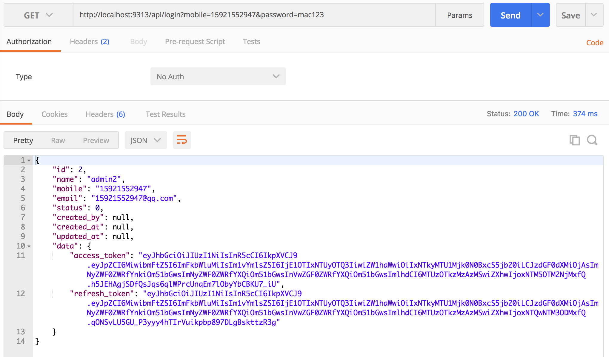

# 项目介绍文档
使用Nodejs+mysql搭建的博客系统。使用koa2 ES6语法开发，webpack打包。
数据库方面，既可以直接原生连接进行数据操作，也可以使用sequlize ORM框架对数据操作。

## 功能介绍
+ 注册与Jwt登陆认证
+ 用户以及权限管理
+ 博客发布管理
+ 文件上传
+ 博客标签管理
+ 博客评论管理
+ 博客点赞
+ 博客阅读量
+ 博客前台 ejs 模板引擎
+ 集成 swagger 文档
+ 日志记录
+ 项目数据备份
+ 开发以及部署命令行工具

## 项目目录

`|-`dist 打包之后的目录

`|-`docs 文档目录

`|-`logs 运行日志目录

`|-`publicImg 上传的图片目录

`|-`settings 应用设置目录

`|-`src 核心源码目录

&nbsp;&nbsp;&nbsp;`|-`backup-db 数据库备份目录

&nbsp;&nbsp;&nbsp;`|-`config 项目配置目录

&nbsp;&nbsp;&nbsp;`|-`controller 控制器目录

&nbsp;&nbsp;&nbsp;`|-`dao 数据获取与ORM框架model对应

&nbsp;&nbsp;&nbsp;`|-`middleware 中间件目录

&nbsp;&nbsp;&nbsp;`|-`migrations 迁移文件目录

&nbsp;&nbsp;&nbsp;`|-`models 数据模型目录

&nbsp;&nbsp;&nbsp;`|-`route 路由目录

&nbsp;&nbsp;&nbsp;`|-`seeders 数据种子文件目录

&nbsp;&nbsp;&nbsp;`|-`service 链接控制器与模型

&nbsp;&nbsp;&nbsp;`|-`static 静态文件目录

&nbsp;&nbsp;&nbsp;`|-`utils 工具函数目录

&nbsp;&nbsp;&nbsp;`|-`views 前端模板引擎目录

&nbsp;&nbsp;&nbsp;`|-`index.js 入口文件

`|-`backup-db.js 备份

`|-`install.js 命令行工具

`|-`watchChange.js 开发时工具

`|-`webpack.config.js 打包配置


## 环境准备
```
mysql 5.6
node 8+
pm2 2.8

```
## 开始使用 
```
git clone -b master https://github.com/QCCS/tech-share-s.git
```
## 项目设置
应用端口与数据库设置 settings/appSetting.js
```
//此文件不要修改其他，除了添加key与value
export default {
    "development": {
        "app_port": 9313,
        "host": "127.0.0.1",
        "user": "root",
        "password": "password",
        "port": "3306",
        "database": "node_blog_dev"
    },
    "test": {
        "app_port": 9314,
        "host": "127.0.0.1",
        "user": "root",
        "password": "password",
        "port": "3306",
        "database": "node_blog_test"
    },
    "production": {
        "app_port": 9315,
        "host": "127.0.0.1",
        "user": "root",
        "password": "password",
        "port": "3306",
        "database": "node_blog_prod"
    }
}
```
## 安装项目
```
node install initAll
pm2 start dist/index.js -i 0 --name "app-name"
```
## 开发项目
```
//环境准备
node install init
node install mysqlCreateDev
node install sequlizeDevTable
node install seedDataDev
//打包与启动
node install buildDev
node install runDev
```
开发实时编译与重启
```
node watchChange.js
npm run superdev
```
## 部署测试环境
```
//环境准备
node install init
node install mysqlCreateTest
node install sequlizeTestTable
node install seedDataTest
//打包与启动
node install buildTest
node install runTest
```

## 命令行工具
运行

```
node install help
```
输出
```
显示帮助:
node install help
生成环境：打包与数据库环境准备:
node install initAll
安装项目依赖:
node install init
shell创建Prod数据库:
node install mysqlCreateProd
shell创建dev数据库:
node install mysqlCreateDev
shell创建test数据库:
node install mysqlCreateTest
直接导入sql文件:
node install mysqlSource
sequlize创建dev数据库:
node install sequlizeDevDB
sequlize创建dev数据表:
node install sequlizeDevTable
sequlize创建test数据库:
node install sequlizeTestDB
sequlize创建test数据表:
node install sequlizeTestTable
sequlize创建Prod数据库:
node install sequlizeProdDB
sequlize创建Prod数据表:
node install sequlizeProdTable
dev填充数据:
node install seedDataDev
test填充数据:
node install seedDataTest
prod填充数据:
node install seedDataProd
打包开发环境:
node install buildDev
打包开发环境:
node install runDev
打包Test环境:
node install buildTest
运行Test环境:
node install runTest
打包Prod环境:
node install buildProd
运行Prod环境:
node install runProd
备份dev数据库:
node install backup
备份test数据库:
node install backupTest
备份prod数据库:
node install backupProd

```
## 项目截图
